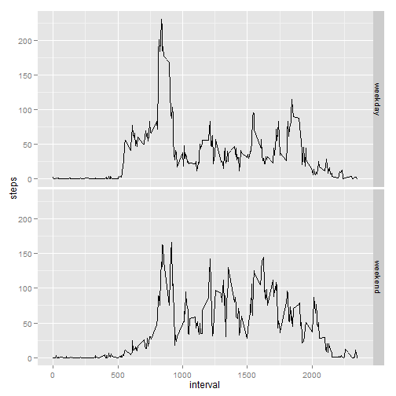

# Reproducible Research: Peer Assessment 1

This is the .rmd file for JHU's Data Science specialization 'Reproducible Research' peer assignments. Please, check that all files have been downloaded and that the working directory is properly set.
* Author: Ghostdatalearner
* Date: July 2014


## Loading and preprocessing the data


```r
raw_data <- read.csv("activity.csv")
# Get the dates when data where recorded
dates_list <- unique(raw_data$date)
```


## What is mean total number of steps taken per day?

```r
library(ggplot2)
# Subset raw_data to ignore records where steps is NA
steps_data <- raw_data[!is.na(raw_data$steps), ]
# Sum steps by day

stepsdaydf <- aggregate(steps_data$steps, by = list(steps_data$date), sum)
names(stepsdaydf) <- c("date", "steps")
# There may be days with NA, because there are not data recorded, we filter
# them
stepsdaydf <- stepsdaydf[!is.na(stepsdaydf$steps), ]
ggplot(stepsdaydf, aes(x = stepsdaydf$steps)) + geom_histogram(binwidth = 1000)
```

 

```r
mean_steps <- mean(stepsdaydf$steps)
median_steps <- median(stepsdaydf$steps)
```

* Steps daily mean (NAs removed): 10766
* Steps daily median (NAs removed): 10765


## What is the average daily activity pattern?

```r
# Auxiliar dataframe with the mean of steps for each interval
auxdf_mean_by_interv <- aggregate(steps_data$steps, by = list(steps_data$interval), 
    mean)
names(auxdf_mean_by_interv) <- c("interval", "mean.steps")
```


```r
ggplot(auxdf_mean_by_interv, aes(x = auxdf_mean_by_interv$interval, y = auxdf_mean_by_interv$mean.steps)) + 
    geom_line()
```

 


## Imputing missing values

```r
# We replace the NA values in the original data by the mean value for that
# interval. The mean is a rational value, but that does not make sense
# counting steps, so we round it.
steps_all <- raw_data
for (i in 1:nrow(steps_all)) if (is.na(steps_all[i, ]$steps)) steps_all[i, ]$steps = as.integer(auxdf_mean_by_interv[auxdf_mean_by_interv$interval == 
    steps_all[i, ]$interval, ]$mean.steps)

# We redo the histogram and compute mean and median again to assess the
# effect of NAs Copying code is a bad SW engineering practice but I do it to
# make more clear for the reviewer what the script does, instead of creating
# a function Sum steps by day

stepsdaydf <- aggregate(steps_all$steps, by = list(steps_all$date), sum)
names(stepsdaydf) <- c("date", "steps")
# There may be days with NA, because there are not data recorded, we filter
# them
stepsdaydf <- stepsdaydf[!is.na(stepsdaydf$steps), ]
ggplot(stepsdaydf, aes(x = stepsdaydf$steps)) + geom_histogram(binwidth = 1000)
```

 

```r

mean_steps <- mean(stepsdaydf$steps)
median_steps <- median(stepsdaydf$steps)
```

* Steps daily mean (NAs replaced): 10749
* Steps daily median (NAs replaced): 10641

The effect of replacement is sharp. As NAs are changed by the mean value of the interval, they go towards the overall mean, so the count of cases around it increases. The mean remains almost the same than when
we strip NAs (effect of rounding when making the substitution). The median is a bit lower as the original
distribution is slightly right skewed.


## Are there differences in activity patterns between weekdays and weekends?


```r
# Change the locale to English to manage the 'weekday' and 'weekend'
# categories
Sys.setlocale("LC_TIME", "English")
```

```
## [1] "English_United States.1252"
```

```r
# create a factor with the names of the days for all dates
steps_all$wd <- as.factor(weekdays(as.Date(steps_all$date)))
# replace day name by two levels factor
levels(steps_all$wd) <- list(weekday = c("Monday", "Tuesday", "Wednesday", "Thursday", 
    "Friday"), weekend = c("Saturday", "Sunday"))

dfactivity <- aggregate(steps ~ interval + wd, steps_all, mean)
ggplot(dfactivity, aes(x = interval, y = steps)) + geom_line() + facet_grid(wd ~ 
    .)
```

 

